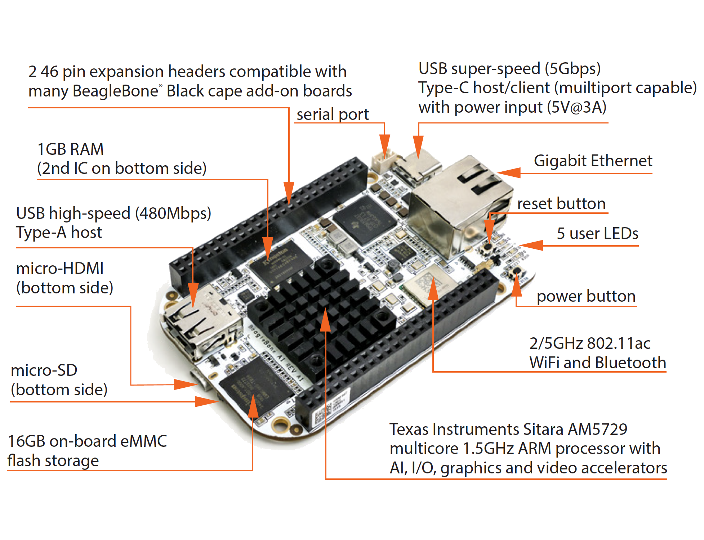

# Beaglebone AI
## Getting Started


### Boot from SD-card:
1. Download the latest software image from beagleboard.org/latest-images. 
2. Download and install balenaEtcher.
3. Connect SD card to your computer.
4. Write the image to your SD card.
5. Eject the SD card.

Insert SD card into your (powered-down) board, hold down the POWER button and apply power, either by the USB cable or 5V adapter.

### Expanding File System Partition On A microSD:
By default the microSD image is only about 4GB in size, to fully expand the partition to the full size of your microSD card simple run.

Note:
Beaglebone AI has 15 GB EMMC in-build memory.

```python
cd /opt/scripts/tools/
git pull || true
sudo ./grow_partition.sh
sudo reboot
```

### Connect to WIFI:
```python
debian@beaglebone:/var/lib/cloud9$ sudo connmanctl
connmanctl> scan wifi
Scan completed for wifi
connmanctl> services
    Digital4tress        wifi_c0e4342dcf9d_4469676974616c347472657373_managed_psk
connmanctl> agent on
Agent registered
connmanctl> connect wifi_c0e4342dcf9d_4469676974616c347472657373_managed_psk
Agent RequestInput wifi_c0e4342dcf9d_4469676974616c347472657373_managed_psk
  Passphrase = [ Type=psk, Requirement=mandatory, Alternates=[ WPS ] ]
  WPS = [ Type=wpspin, Requirement=alternate ]
Passphrase? password
Connected wifi_c0e4342dcf9d_4469676974616c347472657373_managed_psk
connmanctl> quit
```
### SSH Connection:
```python
ssh debian@192.168.7.2
default Password: temppwd
```
### Tidl Example
```python
sudo apt-get install ti-tidl
```

### Documentation
[Processor SDK - Linux - Software Developer's Guide](http://software-dl.ti.com/processor-sdk-linux/esd/docs/latest/linux/Overview_Building_the_SDK.html)
